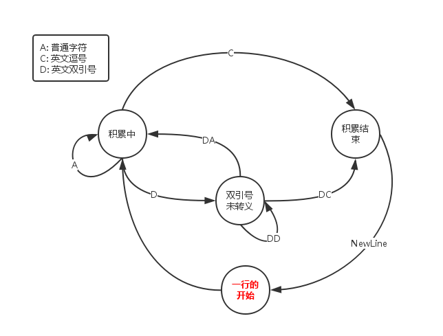

# 功能
CSVReader是一个读取CSV格式文件的一个工具类


# csv格式的介绍
参考[维基百科](https://zh.wikipedia.org/zh/%E9%80%97%E5%8F%B7%E5%88%86%E9%9A%94%E5%80%BC)

1. 可以有表头
2. 一行成为一个记录，一个记录由若干个字段组成，相邻两格字段由英文逗号隔开，比如name,age,sex
3. 若字段包含逗号，则字段应该由英文双引号""括起来，比如"I, Tom, is a cute boy."
4. 若字段包含英文双引号，则字段应该由英文双引号括起来，并且原来的每个双引号都应该转义为两个双引号，比如原来是They say, "We are done"应该转为"They say, ""We are done"""


# 数据存储
一开始数据用的是`vector<vector<string> >`来存储，但是后来发现，我在有的地方会需要用`map<string, vector<string> >`的数据结构来存储，谁知道以后会不会有更多的数据结构的需求呢～

所以我就把从csv文件读取出数据之后存入某数据结构的操作抽象出来了，成为：
1. 把一个记录的字段按顺序写入
2. 这一个记录写完了，“换行”

于是它们就成为一个抽象接口了，CSVReader类只需要依赖这个抽象接口就可以了，底层的实现由具体的容器去做。下面是这个抽象接口的展示：

```C++
#ifndef __CSV_CONTAINER_ADAPTER_H__
#define __CSV_CONTAINER_ADAPTER_H__

#include <string>
using namespace std;


class CSVContainerAdapter
{
public:
	virtual void addToRow(const string& cell) = 0;
	virtual void addToRowDone() = 0;
	virtual void display() const = 0;
};

#endif
```


# 读取算法
用两个标志记录当前记录的读取状态：

1. 字段是否含有逗号：have_comma
2. 字段是否被双引号包裹：half_cell

顺序按字节扫描过去，如果字段有逗号，并且没有被双引号包裹，说明这是一个普通的字段，已经到了结尾了，读取完毕，可进入对下一个字段的读取。

如果当前字节是双引号，那么情况就有点复杂了，它可能是以下x中情况：

1. 被双引号包裹的字段的开始，判断依据是half_cell = false，注意这个开始的双引号是要去掉的； 
2. 被双引号包裹的字段的中间，也就是被转义的双引号的第一个，判断依据是half_cell = true并且后面还有字符且那个字符也是双引号，此时应该“跳过一格”（就是把下标加1），因为双引号被转义是变成了两个连续的双引号，所以它后面那个是多余的双引号，只保留一个就好了；
3. 被双引号包裹的字段的结束，判断依据是half_cell = true且（后面没有字符了，或后面的字符不是双引号），注意结尾的这个双引号也是要去掉的。

画成**状态机**就是：




# 项目组成
1. CSVReader.h和CSVReader.cpp是用来读取csv的主体
2. CSVContainerAdapter.h是一个适配各种数据接口的抽象类接口
3. CSVVectorContainer.h和CSVVectorContainer.cpp是一个用`vector<vector<string> >`来存储数据的适配器实现例子
4. CSVMapContainer.h和CSVMapContainer.cpp是一个用`map<string, vector<string> >`来存储数据的适配器实现，其中键值为string，其实是来源于原数据的指定列，该列不能重复

